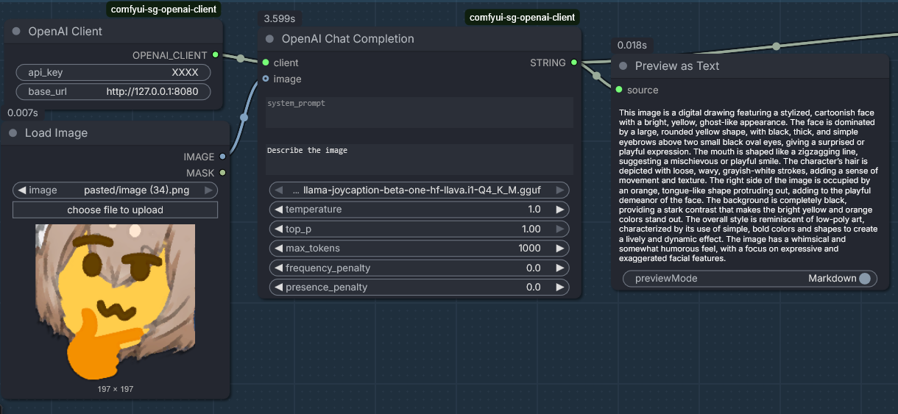

# comfyui-sg-openai-client

Custom nodes for ComfyUI to integrate with OpenAI API (local supported), providing chat completion capabilities with support for images.



## Features

- **OpenAI Client Node**: Authenticate with OpenAI API using API key and optional custom base URL. Supports OpenAI-compatible providers (Ollama, OpenRouter, etc.).
- **OpenAI Chat Completion Node**: Generate text completions with system/user prompts, vision support via image batches, and advanced sampling parameters.
- **Vision Support**: Supports single images or image batches (via "Batch Images" node).
- **Advanced Parameters**: Includes `top_k`, `min_p`, `seed`, and custom JSON parameter injection.

## Installation

1. Clone this repository into your ComfyUI `custom_nodes` directory:
   ```bash
   git clone https://github.com/sebagallo/comfyui-sg-openai-client.git
   cd ComfyUI/custom_nodes/comfyui-sg-openai-client
   pip install -r requirements.txt
   ```

2. Restart ComfyUI to load the custom nodes.

## Usage

### OpenAI Client Node
- **Inputs**:
  - `api_key` (required): Your OpenAI API key.
  - `base_url` (optional): Custom API base URL (defaults to OpenAI's).
- **Output**: OpenAI client object for use in other nodes.

### OpenAI Chat Completion Node
- **Required Inputs**:
  - `client`: Connected from OpenAI Client Node.
  - `system_prompt`: System message for the conversation context.
  - `user_prompt`: User message to generate a response for.
  - `model`: Model selection (Dropdown).
- **Optional Inputs**:
  - `images`: Image tensor(s). Supports image batches for multi-image context.
  - `temperature`: Randomness (0.0-10.0, default 1.0).
  - `top_p`: Nucleus sampling (0.0-1.0, default 1.0).
  - `top_k`: Limits next tokens to top k (Unofficial/Provider-specific).
  - `min_p`: Probability threshold relative to top token (Unofficial/Provider-specific).
  - `max_tokens`: Maximum tokens to generate (1-32768, default 1000).
  - `frequency_penalty`: Penalize frequency (-2.0-2.0, default 0.0).
  - `presence_penalty`: Penalize presence (-2.0-2.0, default 0.0).
  - `seed` (optional): Set an integer seed for deterministic results (mostly).
  - `extra_parameters`: Custom JSON string for any additional provider-specific parameters (e.g., `{"logit_bias": {...}}`).
- **Output**: Generated completion text.

## API Endpoint
The package adds a POST endpoint `/sg_openai_models` to ComfyUI's server for fetching available models. It requires `api_key` and optional `base_url` in the request body.

## Requirements
- ComfyUI
- OpenAI Python client (included in requirements.txt)

## License
See LICENSE file.
